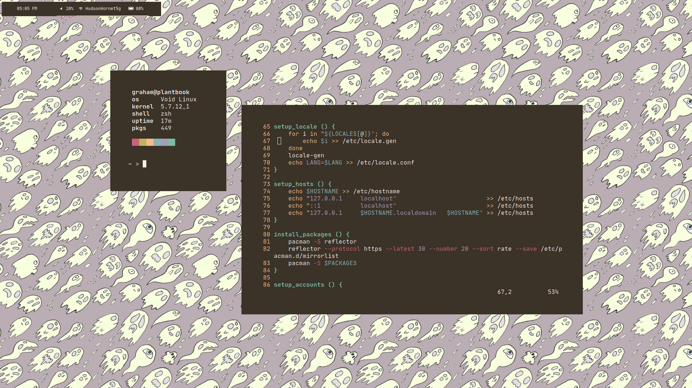

# transients

# installation
Files in ``Profiles + RCs`` go in your home directory.

Files in ``X Config`` go to ``/etc/X11/``.

Files in ``Shell Scripts`` can be called from anywhere, but make sure to read the comments first.

Finally, files in ``.config`` go to your own config directory.
