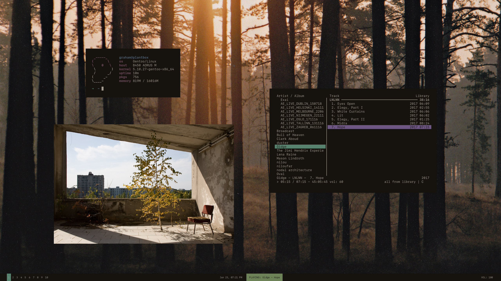

# transients

Welcome to my dotfiles repo!
# installation
Files in ``Other Dotfiles`` go in your homedir.

Files in ``X Config`` go to ``/etc/X11/``.

Finally, files in ``.config`` go to your own config directory.
